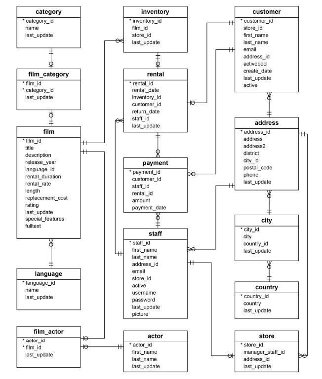

# DVD Rental Database Analysis

## Overview

This repository contains the results of a comprehensive data analysis performed on a popular DVD rental database. The database was restored from a .tar archive file into a PostgreSQL server, and it consists of 15 tables capturing various aspects of the DVD rental business.

## Database Structure

The DVD Rental database is comprised of the following tables:

1. **actor**: Stores actors' data including first name and last name.
2. **film**: Contains film data such as title, release year, length, rating, etc.
3. **film_actor**: Stores the relationships between films and actors.
4. **category**: Holds film category data.
5. **film_category**: Captures relationships between films and categories.
6. **store**: Contains store data including manager staff and address.
7. **inventory**: Stores inventory data.
8. **rental**: Captures rental data.
9. **payment**: Stores customer payment information.
10. **staff**: Contains staff data.
11. **customer**: Stores customer data.
12. **address**: Holds address data for staff and customers.
13. **city**: Stores city names.
14. **country**: Stores country names.

## Analysis Highlights

The analysis performed on the DVD Rental database includes, but is not limited to, the following:

1. **Profits of DVD Rental Stores:**
   - Determination of profits for each DVD rental store.

2. **Most Rented Movie Title:**
   - Identification of the most rented movie title.

3. **Top-Spending Customer:**
   - Determination of the customer who has spent the most on DVD rentals.

4. **Unrented Titles:**
   - Identification of titles that have not yet been rented.

## Usage

To replicate the analysis or explore the dataset further, follow these steps:

1. **Database Restoration:**
   - Restore the database from the provided .tar archive in the `data` directory file into a PostgreSQL server.

2. **Run Queries:**
   - Utilize SQL queries provided in the `queries` directory to perform the analysis.

## Directory Structure

- **queries/:** Contains SQL queries used for the analysis.
- **data/:** Holds the backed-up database.

Feel free to explore, replicate, and build upon this analysis for further insights into the DVD rental business.
